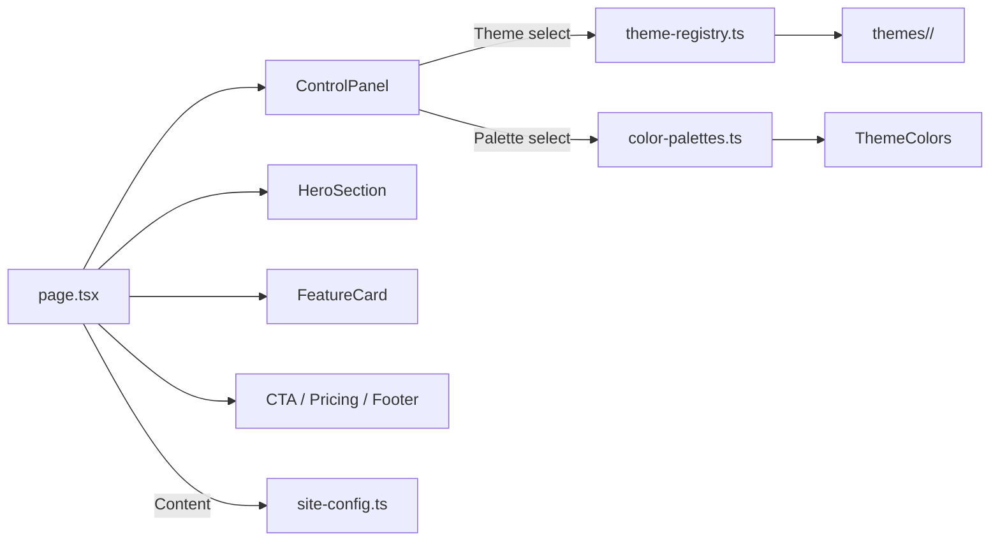

# Build Landing Page

> Mix and match 31 themes × 38 color palettes in real-time to explore landing page designs — built with Next.js

🔗 **Demo:** `https://jinwoo-j.github.io/landing-maker/`

---

## Overview

**Themes** (layout & animation) and **color palettes** are fully decoupled, so you can freely mix and match any combination.
Switch themes and colors instantly from the right-side control panel, and hit **Copy Prompt** to generate an AI design prompt for the current combination.

## Features

- ✅ **31 Themes** — Voxel 3D, Glassmorphism, Neon Cyberpunk, Synthwave, Art Deco, and more
- ✅ **38 Color Palettes** — Dark / Light / Vibrant categories
- ✅ **Real-time Switching** — Instant theme & palette changes via the side panel
- ✅ **Copy Prompt** — Export current theme + palette as an AI design prompt
- ✅ **Three.js Voxel 3D** — Interactive 3D voxel world theme
- ✅ **Content Separation** — All site text managed in a single `site-config.ts`

## Copy Prompt

**Copy Prompt** converts the current theme + palette combination into an AI-ready design prompt.

1. Pick a theme and palette from the control panel.
2. Click **Copy Prompt** — the prompt is copied to your clipboard.
3. Paste it into ChatGPT, Claude, Cursor, or any AI tool to generate a website with the same mood and color scheme.

The prompt includes the theme's visual style description and all 8 palette color codes (Primary, Secondary, Accent, Background, Surface, Text, TextMuted, Border).

---

## Themes (31)

### 🧊 3D / Interactive

| Theme | Description |
|-------|-------------|
| Voxel 3D | Interactive 3D voxel world with Three.js |
| Particles | Floating particle system with connecting lines |
| Isometric | Isometric grid with geometric shapes |

### 🌈 Glass / Gradient / Morphism

| Theme | Description |
|-------|-------------|
| Glassmorphism | Frosted glass with depth and blur effects |
| Gradient Mesh | Vibrant gradient blobs and organic shapes |
| Neumorphism | Soft shadows and embossed surfaces |
| Aurora Borealis | Northern lights with ethereal glow animations |
| Hologram | Sci-fi holographic projections with flicker |

### 🌃 Cyber / Retro

| Theme | Description |
|-------|-------------|
| Neon Cyberpunk | Dark neon glow with cyberpunk aesthetics |
| Synthwave | 80s retro sunset with neon grid and chrome |
| Retro Pixel | 8-bit pixel art with CRT vibes |
| Matrix Rain | Falling code rain with green phosphor glow |
| Cassette | Retro mixtape with VU meters and tape reels |
| Terminal | Hacker terminal with monospace aesthetics |

### 🎨 Art / Classic

| Theme | Description |
|-------|-------------|
| Art Deco | 1920s geometric elegance with gold accents |
| Stained Glass | Colorful mosaic panels with lead-line borders |
| Marble | Elegant marble veins with gold accents |
| Watercolor | Soft watercolor washes on paper texture |
| Origami | Paper fold aesthetics with soft creases |
| Newspaper | Classic editorial layout with serif typography |

### 🔬 Tech / Science

| Theme | Description |
|-------|-------------|
| Blueprint | Technical blueprint with grid lines and wireframes |
| Circuit Board | PCB traces, IC chips, and signal paths |
| DNA Helix | Biotech double helix with molecular nodes |
| Constellation | Star maps with connecting constellation lines |

### 🏔️ Nature / Landscape

| Theme | Description |
|-------|-------------|
| Topography | Contour map lines with elevation markers |
| Coral Reef | Underwater coral branches with floating bubbles |
| Sand Dunes | Desert landscape with warm golden gradients |
| Zen | Minimalist Japanese-inspired calm aesthetics |

### ✨ Minimal / Geometric

| Theme | Description |
|-------|-------------|
| Minimal Clean | Clean typography with generous whitespace |
| Geometric | Abstract geometric shapes and patterns |
| Brutalist | Raw, bold typography with hard edges |

---

## Palettes (38)

### 🌙 Dark (19)

Indigo Rose · Violet Pink · Cyan Magenta · Warm Earth · Arctic Cyan · Ocean Deep · Sunset Blaze · Midnight Gold · Forest Emerald · Lava · Neon Lime · Sakura · Copper Rust · Blood Moon · Deep Space · Charcoal Amber · Ice Storm · Wine Velvet · Jungle

### ☀️ Light (11)

Monochrome · Purple Teal · Frost · Lavender Dream · Mint Fresh · Peach Cream · Warm Sand · Rose Garden · Sky Blue · Cream Cocoa · Slate Teal

### 🎆 Vibrant (8)

Candy Pop · Electric Blue · Synthwave Pink · Toxic Green · Royal Purple · Bubblegum · Aurora Green · Neon Orange

---

## Tech Stack

| Tech | Version |
|------|---------|
| Next.js | 16 |
| React | 19 |
| TypeScript | 5 |
| Tailwind CSS | 4 |
| Three.js | 0.183 (Voxel theme) |

## Quick Start

```bash
git clone <repository-url>
cd <repo-name>
npm install
npm run dev
```

Open `http://localhost:3000` in your browser.

## Deploy to GitHub Pages

A GitHub Actions workflow (`.github/workflows/deploy.yml`) is included. Pushing to `main` triggers automatic build and deploy.

### Setup

1. Go to your repo → **Settings** → **Pages**.
2. Set **Source** to **GitHub Actions**.
3. Push to `main` — the workflow builds and deploys automatically.

### How it works

- `next.config.ts` uses `output: "export"` for static site generation.
- `NEXT_PUBLIC_BASE_PATH` is set automatically to the repo name in the workflow.
- The `out/` directory is uploaded to GitHub Pages.

Your site will be live at `https://<username>.github.io/<repo-name>/`.

## Project Structure

```
src/
├── app/
│   ├── page.tsx              # Main page (theme & palette state)
│   ├── layout.tsx            # Root layout
│   └── globals.css           # Global styles
├── components/
│   ├── ControlPanel.tsx      # Right-side theme & palette panel
│   ├── layout/               # Nav, Footer
│   └── shared/               # CTA, Pricing, Stats (shared sections)
├── lib/
│   ├── site-config.ts        # Site content (text, pricing, stats)
│   ├── theme-registry.ts     # Theme definitions
│   └── color-palettes.ts     # Color palette definitions
└── themes/
    ├── types.ts              # ThemeDefinition, ThemeColors types
    └── <theme-name>/         # Per-theme directory
        ├── HeroSection.tsx   # Hero section (theme-specific layout)
        ├── FeatureCard.tsx   # Feature card (theme-specific style)
        └── index.ts          # Theme metadata
```

## Architecture



Key design:

- **Theme** = Layout + Animation (`HeroSection`, `FeatureCard`)
- **Palette** = 8 color values (`ThemeColors`)
- They are independent — any theme works with any palette

## Adding a Theme

1. Create `src/themes/<new-theme>/` directory.

2. Add 3 files:

```typescript
// index.ts
import type { ThemeDefinition } from "@/themes/types";

const myTheme: ThemeDefinition = {
  id: "my-theme",
  name: "My Theme",
  description: "Theme description",
  preview: "🎯",
  defaultPaletteId: "indigo-rose",
};

export default myTheme;
```

```typescript
// HeroSection.tsx — Hero area component
// FeatureCard.tsx — Feature card component (implements FeatureCardProps)
```

3. Register in `src/lib/theme-registry.ts` `themes` array.

4. Add dynamic imports in `src/app/page.tsx` for `heroSections` and `featureCards`.

## Adding a Palette

Add to the `palettes` array in `src/lib/color-palettes.ts`:

```typescript
{
  id: "my-palette",
  name: "My Palette",
  preview: "🎨",
  category: "dark",  // "dark" | "light" | "vibrant"
  colors: {
    primary: "#6366f1",
    secondary: "#818cf8",
    accent: "#f43f5e",
    background: "#0a0a1a",
    surface: "rgba(255,255,255,0.05)",
    border: "rgba(255,255,255,0.1)",
    text: "#ffffff",
    textMuted: "#9ca3af",
  },
}
```

## Scripts

| Command | Description |
|---------|-------------|
| `npm run dev` | Start dev server |
| `npm run build` | Production build (static export) |
| `npm run start` | Start production server |
| `npm run lint` | Run ESLint |

## License

MIT
