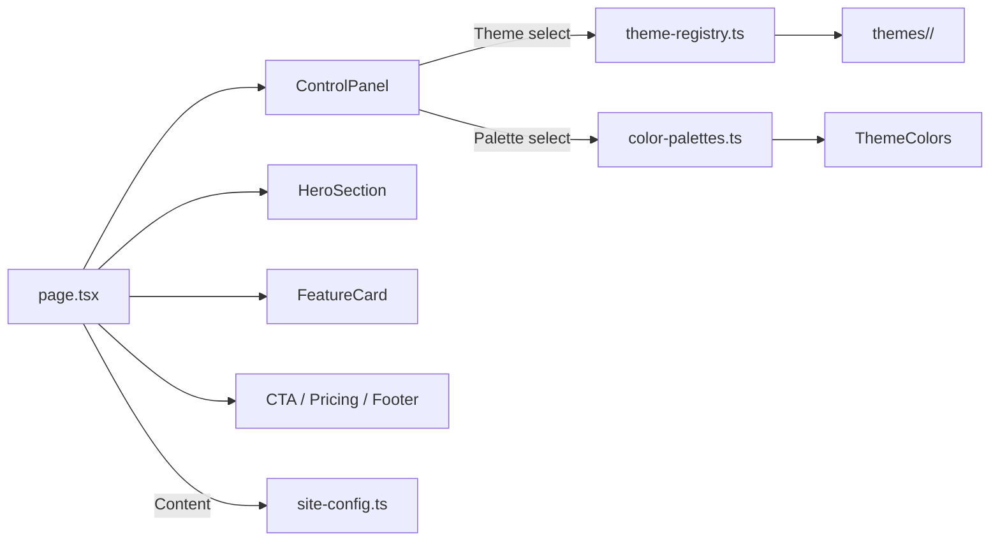

# Build Landing Page

> Mix and match 46 themes × 50 color palettes in real-time to explore landing page designs — built with Next.js

🔗 **Demo:** `https://<username>.github.io/<repo-name>/`

---

## Overview

**Themes** (layout & animation) and **color palettes** are fully decoupled — mix and match any combination freely.
Switch themes and colors instantly from the right-side control panel, and hit **Copy Prompt** to generate an AI design prompt for the current combination.

## Features

- ✅ **46 Themes** — Voxel 3D, Glassmorphism, Neubrutalism, Synthwave, Art Deco, and more
- ✅ **50 Color Palettes** — Dark / Light / Vibrant categories
- ✅ **Real-time Switching** — Instant theme & palette changes via the side panel
- ✅ **Copy Prompt** — Export current theme + palette as an AI design prompt
- ✅ **Three.js Voxel 3D** — Interactive 3D voxel world theme
- ✅ **Content Separation** — All site text managed in a single `site-config.ts`

## Copy Prompt

**Copy Prompt** converts the current theme + palette combination into an AI-ready design prompt.

1. Pick a theme and palette from the control panel.
2. Click **Copy Prompt** — the prompt is copied to your clipboard.
3. Paste it into ChatGPT, Claude, Cursor, or any AI tool to generate a website with the same mood and color scheme.

The prompt includes the theme's visual style description and all 8 palette color codes (Primary, Secondary, Accent, Background, Surface, Text, TextMuted, Border).

---

## Themes (46)

### 🧊 3D / Interactive
Voxel 3D · Particles · Isometric

### 🌈 Glass / Gradient / Morphism
Glassmorphism · Gradient Mesh · Neumorphism · Aurora Borealis · Hologram · Claymorphism · Noise Gradient · Liquid

### 🌃 Cyber / Retro
Neon Cyberpunk · Synthwave · Retro Pixel · Matrix Rain · Cassette · Terminal · Vaporwave · Y2K

### 🎨 Art / Classic
Art Deco · Stained Glass · Marble · Watercolor · Origami · Newspaper · Collage · Dark Academia · Grain Film

### 🔬 Tech / Science
Blueprint · Circuit Board · DNA Helix · Constellation

### 🏔️ Nature / Landscape
Topography · Coral Reef · Sand Dunes · Zen · Chalkboard

### ✨ Minimal / Geometric / Typography
Minimal Clean · Geometric · Brutalist · Neubrutalism · Bento Grid · Bauhaus · Kinetic Type · Parallax Depth · Dopamine

---

## Palettes (50)

### 🌙 Dark (24)
Indigo Rose · Violet Pink · Cyan Magenta · Warm Earth · Arctic Cyan · Ocean Deep · Sunset Blaze · Midnight Gold · Forest Emerald · Lava · Neon Lime · Sakura · Copper Rust · Blood Moon · Deep Space · Charcoal Amber · Ice Storm · Wine Velvet · Jungle · Dark Scholar · Chalk Green · Film Sepia · Matrix Green

### ☀️ Light (16)
Monochrome · Purple Teal · Frost · Lavender Dream · Mint Fresh · Peach Cream · Warm Sand · Rose Garden · Sky Blue · Cream Cocoa · Slate Teal · Clay Pastel · Newspaper Ink · Dopamine Burst · Bauhaus Primary · Neubrutalist

### 🎆 Vibrant (10)
Candy Pop · Electric Blue · Synthwave Pink · Toxic Green · Royal Purple · Bubblegum · Aurora Green · Neon Orange · Y2K Chrome · Vaporwave Sunset

---

## Tech Stack

| Tech | Version |
|------|---------|
| Next.js | 16 |
| React | 19 |
| TypeScript | 5 |
| Tailwind CSS | 4 |
| Three.js | 0.183 (Voxel theme) |

## Quick Start

```bash
git clone <repository-url>
cd <repo-name>
npm install
npm run dev
```

Open `http://localhost:3000` in your browser.

## Deploy to GitHub Pages

A GitHub Actions workflow (`.github/workflows/deploy.yml`) is included. Pushing to `main` triggers automatic build and deploy.

### Setup

1. Go to your repo → **Settings** → **Pages**.
2. Set **Source** to **GitHub Actions**.
3. Push to `main` — the workflow builds and deploys automatically.

### How it works

- `next.config.ts` uses `output: "export"` for static site generation.
- `NEXT_PUBLIC_BASE_PATH` is set automatically to the repo name in the workflow.
- The `out/` directory is uploaded to GitHub Pages.

Your site will be live at `https://<username>.github.io/<repo-name>/`.

## Project Structure

```
src/
├── app/
│   ├── page.tsx              # Main page (theme & palette state)
│   ├── layout.tsx            # Root layout
│   └── globals.css           # Global styles
├── components/
│   ├── ControlPanel.tsx      # Right-side theme & palette panel
│   ├── layout/               # Nav, Footer
│   └── shared/               # CTA, Pricing, Stats (shared sections)
├── lib/
│   ├── site-config.ts        # Site content (text, pricing, stats)
│   ├── theme-registry.ts     # 46 theme definitions
│   └── color-palettes.ts     # 50 color palette definitions
└── themes/
    ├── types.ts              # ThemeDefinition, ThemeColors types
    └── <theme-name>/         # Per-theme directory
        ├── HeroSection.tsx   # Hero section (theme-specific layout)
        ├── FeatureCard.tsx   # Feature card (theme-specific style)
        └── index.ts          # Theme metadata
```

## Architecture



Key design:

- **Theme** = Layout + Animation (`HeroSection`, `FeatureCard`)
- **Palette** = 8 color values (`ThemeColors`)
- They are independent — any theme works with any palette

## Adding a Theme

1. Create `src/themes/<new-theme>/` with 3 files: `index.ts`, `HeroSection.tsx`, `FeatureCard.tsx`
2. Register in `src/lib/theme-registry.ts`
3. Add dynamic imports in `src/app/page.tsx`

## Adding a Palette

Add to the `palettes` array in `src/lib/color-palettes.ts`:

```typescript
{
  id: "my-palette",
  name: "My Palette",
  preview: "🎨",
  category: "dark",  // "dark" | "light" | "vibrant"
  colors: {
    primary: "#6366f1",
    secondary: "#818cf8",
    accent: "#f43f5e",
    background: "#0a0a1a",
    surface: "rgba(255,255,255,0.05)",
    border: "rgba(255,255,255,0.1)",
    text: "#ffffff",
    textMuted: "#9ca3af",
  },
}
```

## Scripts

| Command | Description |
|---------|-------------|
| `npm run dev` | Start dev server |
| `npm run build` | Production build (static export) |
| `npm run start` | Start production server |
| `npm run lint` | Run ESLint |

## License

MIT
